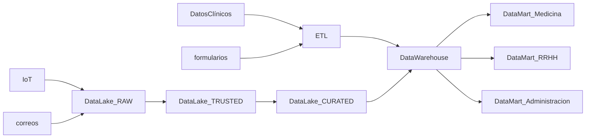
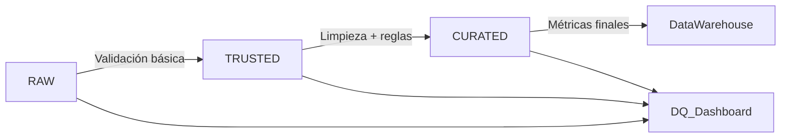

# M5: Arquitectura y Modelamiento de Datos

> `Navegación:` [Módulo 2](https://github.com/git-jrm/ing-datos-M2), [Módulo 3](https://github.com/git-jrm/ing-datos-M3), [Módulo 4](https://github.com/git-jrm/ing-datos-M4), [Módulo 5](https://github.com/git-jrm/ing-datos-M5)

En esta página se desarrolla el proyecto del módulo 5 del bootcamp de ing de datos, llamado "**Proyecto Arquitectura Datos**". Donde abordaremos una solución integral para una empresa que presenta diversos desafíos los cuales se desarrollan por etapas cada una aborda aspectos diferentes.

## Índice:
- [Etapa 1: Arquitectura de Datos](#etapa-1-arquitectura-de-datos)
- [Etapa 2: Enfoques para el Almacenamiento y Gestión de los Datos](#etapa-2-enfoques-para-el-almacenamiento-y-gestión-de-los-datos)
- [Etapa 3: Calidad de los Datos](#etapa-3-calidad-de-los-datos)
- [Etapa 4: Modelamiento Multidimensional](#etapa-4-modelamiento-multidimensional)
- [Análisis transversal](#an%C3%A1lisis-transversal)
- [Conclusión](#conclusi%C3%B3n)

## Etapa 1: Arquitectura de Datos

### Introducción

Este documento tiene como objetivo principal abordar el desafío de la gestión de datos en la empresa InfoHealth. A través del rol de Arquitecto de Datos, se propone un análisis exhaustivo de la situación actual, identificando las deficiencias clave que impiden la optimización de los procesos. 

Basado en este diagnóstico, se presenta una propuesta de arquitectura de datos y un plan de mejora, diseñados para garantizar la escalabilidad, seguridad y accesibilidad, pilares fundamentales para el crecimiento sostenido de la organización en el sector salud.

### Diagnóstico

Debido a la gran abundancia y diversidad de fuentes de datos junto a la falta de arquitectura de datos ha provocado un escenario donde ya se han reportado varios casos de duplicación de datos que sin trazabilidad genera riesgos de confianza, además se han detectado riesgos de seguridad en el acceso a la información.

Esta situación ha afectado al equipo de analistas de datos ya que el tiempo empleado en preprocesar los datos ha crecido exponencialmente.

Además la dirección y el staff médico han perdido la confianza en los reportes, por lo que es clave priorizar el proyecto ya que se requiere un sistema ágil y preciso para apoyar la operación del negocio.

### Propuesta

Se propone una arquitectura basada en capas que separa responsabilidades:

- Fuentes de datos: Datos clínicos, IoT, formularios, correos.
- Almacenamiento: Data Lake (no estructurados), Data Warehouse (estructurados).
- Procesamiento: ETL/ELT.
- Acceso: Dashboards de BI.
- Seguridad: Cifrado de datos. Control de acceso.

Diagrama de fuentes de datos, ingesta, integración y almacenamiento:

### Gobernanza

Para la Gobernanza se aplicaron los principios del marco DAMA-DMBOK destacando los siguientes aspectos:

- Calidad de datos: Garantizar la precisión y consistencia.
- Arquitectura de datos: permite la escalabilidad del sistema, promueve el reuso de componentes y facilita la trazabilidad de los datos.
- Modelado y diseño de datos: organiza los datos para una mejor comprensión y uso, asegurando su consistencia y eficiencia en el acceso.
- Seguridad de datos: proteger la información sensible en reposo, en tránsito y en uso.
- Integración e interoperabilidad de datos: unifica datos de diversas fuentes, permitiendo que sistemas diferentes se comuniquen de manera fluida.
- Data warehousing & business intelligence: proporciona una vista consolidada de los datos para análisis, facilitando la toma de decisiones estratégicas.

### Justificación de diseño

La arquitectura propuesta separa el almacenamiento y procesamiento, permitiendo manejar datos estructurados y no estructurados de forma escalable. Esto mejora la calidad de los datos, la seguridad y la velocidad de los reportes, lo que es vital para el sector salud.

[Volver](#m5-arquitectura-y-modelamiento-de-datos)

## Etapa 2: Enfoques para el Almacenamiento y Gestión de los Datos

### Tecnologías sugeridas

Las herramientas y tecnologías sugeridas por capas son:

- Almacenamiento: Amazon S3 (Data Lake), Amazon Redshift (Data Warehouse).
- Procesamiento: Apache Spark y AWS Glue.
- Acceso: Power BI, Tableau.
- Seguridad: cifrado en reposo y en tránsito mediante AWS y acceso con IAM.

### Gobernanza

Para la Gobernanza se recomiendan las prácticas del DAMA-DMBOK destacando:

- Gestión de metadatos: se implementa catálogo de datos centralizado, documentar fuentes, transformaciones y linaje para trazabilidad.
- Master Data Management: se define utilizar datos maestros únicos para: pacientes, médicos, historial, tratamientos. Para evitar duplicaciones y mantener la consistencia.
- Gestión del ciclo de vida de los datos: se definir políticas para la retención de 3 años de datos, y luego pasa a archivo seguro de información médica.
- Operaciones de datos: se establece procedimiento de monitoreo y backup diario. Y plan de recuperación de catastrofes de menos de 1 horas, garantizando disponibilidad y continuidad del servicio.

[Volver](#m5-arquitectura-y-modelamiento-de-datos)

## Etapa 3: Calidad de los Datos

Objetivo: Diseñar un plan de aseguramiento de calidad de los datos, integrado a la arquitectura definida.

### Controles por etapa

- Ingesta (RAW): validación de formatos, detección de archivos corruptos, verificación de esquemas
- Procesamiento (TRUSTED): reglas de limpieza, detección de duplicados, validación de rangos y dominios.
- Curación (CURATED): consistencia referencial, completitud de datos, exactitud de métricas calculadas.

### Métricas e indicadores

Completitud (% datos faltantes), exactitud (% errores), consistencia (duplicados), puntualidad (latencia de carga).

### Monitoreo y calidad

Implementación de data quality dashboards con alertas automáticas cuando las métricas superen umbrales críticos (ej: >5% datos faltantes). Plan de remediación con escalamiento automático al equipo de datos y re-procesamiento de lotes afectados.

### Integración en arquitectura

Los controles de calidad se ejecutan en cada zona del Data Lake usando AWS Glue DataBrew y Apache Griffin, con resultados almacenados en tablas de auditoría para trazabilidad completa del linaje de datos.

Diagrama de proceso de monitoreo y remediación:

[Volver](#m5-arquitectura-y-modelamiento-de-datos)

## Etapa 4: Modelamiento Multidimensional

### Introducción

En la actualidad la empresa Mercato del sector retail está comenzando a tener problemas de ralentización en el sistema ocasionado por la carga que supone los procesos de analitica del departamento de business intelligence quienes requieren con urgencia mejorar su sistema de analitica. Esta situación impacta a toda la organización por lo que es prioritaria.

### Diagnóstico

Luego de un análisis de la situación se concluyó que la lentitud que se ha empezado a reportar este último periodo está siendo generada actualmente por el sistema realtime de analitica que realiza sus consultas directamente a la base de datos transaccional OLTP.

Esto además de carga de procesamiento ha comenzado a generar complejidad operativa en el sistema de consultas con relaciones complejas.

### Propuesta

Diseño modelo multidimensional:

Definimos a nivel de Gobernanza de Datos una implementación de una solución de Data Warehouse, con enfoque bottom-up de Ralph Kimball. Esto nos permitirá centrarnos en el modelado multidimensional del Data Mart del área inteligencia de negocios.

Como analista de datos vamos a realizar una propuesta desarrollando el modelado multidimensional para los hechos de ventas y sus dimensiones relevantes. Mediante un cubo OLAP para análisis de hechos de ventas.

Tabla de hechos “Ventas”: id_p, id_c, id_s, id_t, cantidad, importe_unitario, importe_total.
Tabla de dimensiones Producto, Cliente, Sucursal, Tiempo.

Jerarquías y atributos de las dimensiones:

Producto: SKU → subcategoría → categoría (nombre_producto, marca, modelo)
Cliente: nicho → segmento → tipo (nombre_cliente, edad, email)
Sucursal: ciudad → región →país (nombre_sucursal, dirección, comuna).
Tiempo: día → mes → año (nombre_dia, dia_habil, descuento)

Con esta solución optimizada para lectura obtenemos escalabilidad, rendimiento analítico, facilidad para las consultas y presión para la toma de decisiones estratégicas.

### Justificación de diseño

Se optó por modelar un esquema estrella más simple que el esquema copo de nieve, ya que tiene menos tablas que mantener la complejidad es más baja, también la complejidad de las consultas.

El esquema al estar orientado a consultas simples realiza una desnormalización controlada ganando simplicidad y eficiencia. Además es evolutivo porque facilita agregar nuevas dimensiones y métricas si se requiere.

Se complementa con la implementación de Slowly Changing Dimensions “Type 4”, para una tabla separada con data histórica (ej: más de 3 años).

[Volver](#m5-arquitectura-y-modelamiento-de-datos)

## Análisis transversal

análisis transversal 1:
La implementación de la arquitectura de datos propuesta para InfoHealth representa un paso decisivo hacia la madurez digital. Las principales ventajas de esta nueva arquitectura son la mejora en la calidad, integridad y seguridad de la información, además de garantizar el cumplimiento normativo (según la norma IEC 62304), lo cual transmite confianza a los pacientes y a la comunidad en general.

También aprendimos la relevancia de dar cumplimiento y mantenerse actualizado sobre normativas vigentes de la industria, como lo es en este caso la HIPPA si el sistema funcionará en EEUU, además de normas como la GDPR en Europa y CCPA en California.

análisis transversal 2 (quizas no sea necesario desarrollar):
análisis transversal 3 (quizas no sea necesario desarrollar):

análisis transversal 4:
La implementación del Data Warehouse con modelo estrella representa una solución técnicamente sólida para los problemas actuales de Mercato, sin embargo su éxito también dependerá de una correcta implementación y adopción a nivel organizacional de  la Gobernanza.

El enfoque bottom-up de Ralph Kimball proporciona flexibilidad incremental al permitir desarrollar Data Marts específicos por área, reduciendo riesgos y complejidad inicial además facilita la adopción gradual.

El modelado multidimensional del cubo OLAP permitirá un análisis ágil y profundo de los datos de ventas, potenciando la toma de decisiones estratégicas basadas en información confiable y oportuna, clave para el crecimiento sostenible de Mercato.

[Volver](#m5-arquitectura-y-modelamiento-de-datos)

## Conclusión

Conclusión ...
