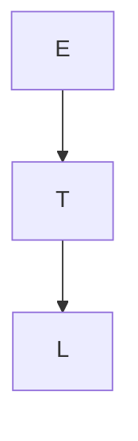

# M5: Arquitectura y Modelamiento de Datos

> `Navegación:` [Módulo 2](https://github.com/git-jrm/ing-datos-M2), [Módulo 3](https://github.com/git-jrm/ing-datos-M3), [Módulo 4](https://github.com/git-jrm/ing-datos-M4), [Módulo 5](https://github.com/git-jrm/ing-datos-M5)

En esta página se desarrolla el proyecto del módulo 5 del bootcamp de ing de datos, llamado "**Proyecto Arquitectura Datos**". Donde abordaremos una solución integral para una empresa que presenta diversos desafíos los cuales se desarrollan por etapas cada una aborda aspectos diferentes.

## Índice:
- [Etapa 1: Arquitectura de Datos](#)
- [Etapa 2: Enfoques para el Almacenamiento y Gestión de los Datos](#)
- [Etapa 3: Calidad de los Datos](#)
- [Etapa 4: Modelamiento Multidimensional](#)
- [Conclusión: ](#)

## Etapa 1: Arquitectura de Datos

### Introducción

Este documento tiene como objetivo principal abordar el desafío de la gestión de datos en la empresa InfoHealth. A través del rol de Arquitecto de Datos Junior, se propone un análisis exhaustivo de la situación actual, identificando las deficiencias clave que impiden la optimización de los procesos. 

Basado en este diagnóstico, se presenta una propuesta de arquitectura de datos y un plan de mejora, diseñados para garantizar la escalabilidad, seguridad y accesibilidad, pilares fundamentales para el crecimiento sostenido de la organización en el sector salud.

### Diagnóstico

Debido a la gran abundancia y diversidad de fuentes de datos junto a la falta de arquitectura de datos ha provocado un escenario donde ya se han reportado varios casos de duplicación de datos que sin trazabilidad genera riesgos de confianza, además se han detectado riesgos de seguridad en el acceso a la información.

Esta situación ha afectado al equipo de analistas de datos ya que el tiempo empleado en preprocesar los datos ha crecido exponencialmente.

Además la dirección y el staff médico han perdido la confianza en los reportes, por lo que es clave priorizar el proyecto ya que se requiere un sistema ágil y preciso para apoyar la operación del negocio.

### Propuesta

Se propone una arquitectura basada en capas que separa responsabilidades:

· Fuentes de datos: Datos clínicos, IoT, formularios, correos.
· Almacenamiento: Data Lake (no estructurados), Data Warehouse (estructurados).
· Procesamiento: ETL/ELT.
· Acceso: Dashboards de BI.
· Seguridad: Cifrado de datos. Control de acceso.

Diagrama de fuentes de datos:
```mermaid
graph LR;
  Datos clínicos-->T;
  E-->T;
  T-->L;
```

- Arquitectura de Data por Capas:
  - Ingesta (Fuentes de datos):
    - Sistema de ventas (transaccional)
    - Redes sociales (no relacional)
    - CRM (relacional)
  - Integración (ETL)
  - Almacenamiento (Data Warehouse)
  - Calidad (Gobernanza)
  - Consumo (Visualización)

Herramientas por capas:

· Almacenamiento: Amazon S3 (Data Lake), Amazon Redshift (Data Warehouse).
· Procesamiento: Apache Spark y AWS Glue.
· Acceso: Power BI, Tableau.
· Seguridad: cifrado en reposo y en tránsito mediante AWS y acceso con IAM.

### Principios aplicados

Dentro de todas las consideraciones que se tuvieron según el marco DAMA-DMBOK se destacan las siguiente:

· Calidad de datos: Garantizar la precisión y consistencia.

· Arquitectura de datos: permite la escalabilidad del sistema, promueve el reuso de componentes y facilita la trazabilidad de los datos.

· Modelado y diseño de datos: organiza los datos para una mejor comprensión y uso, asegurando su consistencia y eficiencia en el acceso.

· Seguridad de datos: proteger la información sensible en reposo, en tránsito y en uso.

· Integración e interoperabilidad de datos: unifica datos de diversas fuentes, permitiendo que sistemas diferentes se comuniquen de manera fluida.

· Data warehousing & business intelligence: proporciona una vista consolidada de los datos para análisis, facilitando la toma de decisiones estratégicas.

### Justificación de diseño

La arquitectura propuesta separa el almacenamiento y procesamiento, permitiendo manejar datos estructurados y no estructurados de forma escalable. Esto mejora la calidad de los datos, la seguridad y la velocidad de los reportes, lo que es vital para el sector salud.


## Etapa 2: Enfoques para el Almacenamiento y Gestión de los Datos

Objetivo: Definir y justificar las estrategias de almacenamiento y gobernanza de los datos, alineadas al diseño arquitectónico.

### Aspecto técnico

Arquitectura de Data por Capas: 
  -Ingesta (Fuentes de datos):
    -Sistema de ventas (transaccional) --> Data Mart ventas
    -Redes sociales (no relacional) --> Data Lake rrss
    -CRM (relacional) --> Data Lake clientes
  -Integración (ETL)
  -Almacenamiento (Data Warehouse)
  -Calidad (Gobernanza)
  -Consumo (Visualización)

### Diagrama ...

### Justificación


## Etapa 3: Calidad de los Datos

### Aspecto técnico

### Diagrama

### Justificación


## Etapa 4: Modelamiento Multidimensional

### Aspecto técnico

### Diagrama

### Justificación


## Conclusión


#### ...





```dot
diagraph G {
  E -> T
  T -> L
}
```
```dot (enfine="circo")
diagraph G {
  E -> T
  T -> L
}
```
